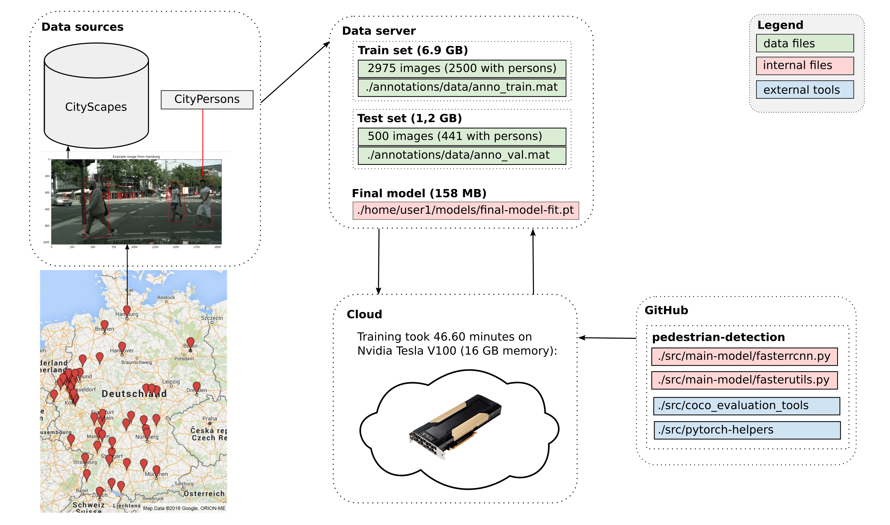
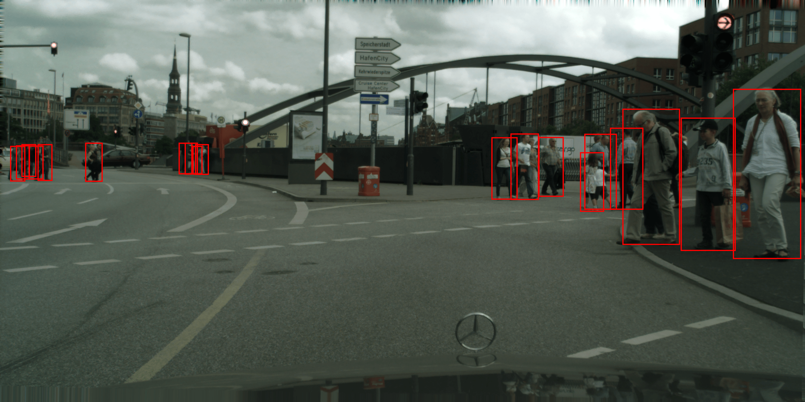
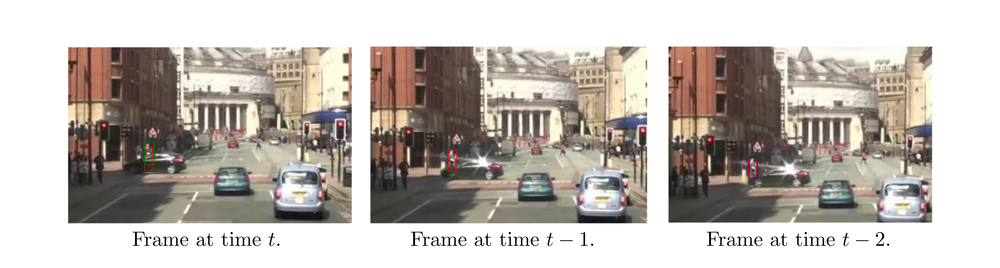

# Pedestrian detection for autonomous driving applications

This repository contains the source code of a research project to develop a machine learning model that detects pedestrians in images with a focus on autonomous driving applications.

Check the [testing video](https://youtu.be/M0r1JTfh9fE) of to see the model detections.

## Overview

The main model is a modified PyTorch implementation of Faster R-CNN with ResNet50 Backbone pre-trained on COCO dataset. The architecture was modified for pedestrian detection and fine-tuned on annotations from CityPersons dataset and images from CityScapes dataset. See the technical overview in Figure below.

<p align="center">

</p>

## How-to

You can download the fitted model from here: <ins>[final-model.pt](https://drive.google.com/uc?export=download&confirm=MDR4&id=1pFoKi4c4pAJAGaXbjZ9jKAwMP6zl-4sq)</ins>

The code was written in Python and tested on Ubuntu 20.04.1 LTS using Python 3.8.10 and PyTorch library version 1.8.0. To install all the dependencies run:

```bash
pip install --upgrade pip
pip install torch==1.8.0
pip install torchvision
pip install pycocotools
```

Import the modules of the main model:
```python
import os
import sys

module_path = os.path.abspath(os.path.join('../src/main-model/'))
if module_path not in sys.path:
    sys.path.append(module_path)

import fasterutils
import fasterrcnn
```

Import other modules to run the model:
```python
import torch
import torch.utils.data
from torchvision import transforms
transform = transforms.Compose([transforms.ToTensor(),])
from PIL import Image
```

Then, load the model:
```python
model = torch.load(
    f = '/home/marko/data/models/final-model-fit.pt',
    map_location = torch.device('cpu'));
```

As an example, let's pick an image from Hamburg (in `../figures/` directory):
```python
img = Image.open('../figures/hamburg.png')

model.eval()
img_tr = torch.unsqueeze(transform(img), 0)
with torch.no_grad():
    pred = model(img_tr)[0]
```

In the returned object `pred` you can find predicted bounding boxes around objects that were detected as pedestrians by the model. For each bounding box there is a corresponding score, that is the estimated likelihood of pedestrian in the bounding box:

```python
pred
{'boxes': array([[ 807.6329 ,  343.27094,  890.54095,  541.85565] ...
 'scores': array([0.99913067, ... , 0.05334361], dtype=float32)}
```

Then, you can use `show()` function from our `fasterutils` module on transformed results:
```python
bboxes, labels, scores = pred['boxes'], pred['labels'], pred['scores']
bboxes, labels, scores = [arr.cpu().detach().numpy() for arr in [bboxes, labels, scores]]
fasterutils.show(img, bboxes, scores)
```

To get the image below:
<p align="center">

</p>


## Evaluation results

The Citypersons validation set of 500 images and corresponding annotations were used for testing. In particular, 441 images where there is at least on person in the image, from cities: Munster, Frankfurt, Lindau.

Below are the results for AP and AR measures:

|         Measure         |    IoU Range  | Area       |   MaxDets          |   Value      |
|-------------------------|---------------|-------------|-------------|---------|
| Average Precision  (AP) | 0.50:0.95 |   all | 100 | 0.461 |
| Average Precision  (AP) | 0.50      |   all | 100 | 0.754 |
| Average Precision  (AP) | 0.75      |   all | 100 | 0.492 |
| Average Precision  (AP) | 0.50:0.95 |  small | 100 | 0.087 |
| Average Precision  (AP) | 0.50:0.95 | medium | 100 | 0.392 |
| Average Precision  (AP) | 0.50:0.95 |  large | 100 | 0.616 |
| Average Recall     (AR) | 0.50:0.95 |   all | 1 | 0.095 |
| Average Recall     (AR) | 0.50:0.95 |   all | 10 | 0.417 |
| Average Recall     (AR) | 0.50:0.95 |   all | 100 | 0.550 |
| Average Recall     (AR) | 0.50:0.95 |  small | 100 | 0.340 |
| Average Recall     (AR) | 0.50:0.95 | medium | 100 | 0.506 |
| Average Recall     (AR) | 0.50:0.95 | large  | 100 | 0.663 |

And using log-average miss rate (MR) measures, for comparison using [CityPersons Benchmark Table](https://github.com/cvgroup-njust/CityPersons):

|         Method         | External   training data | MR (Reasonable) | MR (Reasonable_small) | MR (Reasonable_occ=heavy) | MR (All) |
|:----------------------:|:----------------------:|:---------------:|:---------------------:|:-------------------------:|:--------:|
| [APD-pretrain](https://arxiv.org/abs/1910.09188) |  √ |      7.31%     |         10.81%        |           28.07%          |  32.71%  |
| [Pedestron](https://arxiv.org/abs/2003.08799) |  √ |      7.69%     |         9.16%        |           27.08%          |  28.33%  |
| [APD](https://arxiv.org/abs/1910.09188) |  ×  |      8.27%     |         11.03%        |           35.45%          |  35.65%  |
| YT-PedDet |  ×  |      8.41%     |         10.60%        |           37.88%          |  37.22%  |
| STNet |  ×  |      8.92%     |         11.13%        |           34.31%          |  29.54%  |
| [MGAN](https://arxiv.org/abs/1910.06160) |  ×  |      9.29%     |         11.38%        |           40.97%          |  38.86%  |
| DVRNet |  ×  |      11.17%     |         15.62%        |           42.52%          |  40.99%  |
| [HBA-RCNN](https://arxiv.org/abs/1911.11985) |  ×  |      11.26%     |         15.68%        |           39.54%          |  38.77%  |
| [OR-CNN](https://arxiv.org/abs/1807.08407)     |  ×  |      11.32%     |         14.19%        |           51.43%          |  40.19%  |
| [AdaptiveNMS](http://openaccess.thecvf.com/content_CVPR_2019/papers/Liu_Adaptive_NMS_Refining_Pedestrian_Detection_in_a_Crowd_CVPR_2019_paper.pdf)     |  ×  |      11.40%     |         13.64%        |           46.99%          |  38.89%  |
| [Repultion Loss](http://arxiv.org/abs/1711.07752)     |  ×  |      11.48%     |         15.67%        |           52.59%          |  39.17%  |
| [Cascade MS-CNN](https://arxiv.org/abs/1906.09756)     |  ×  |      11.62%     |         13.64%        |           47.14%          |  37.63%  |
| [Adapted FasterRCNN](http://202.119.95.70/cache/12/03/openaccess.thecvf.com/f36bf52f1783160552c75ae3cd300e84/Zhang_CityPersons_A_Diverse_CVPR_2017_paper.pdf)  |  ×  |      12.97%     |         37.24%        |           50.47%          |  43.86%  |
| [MS-CNN](https://arxiv.org/abs/1607.07155)     |  ×  |      13.32%     |         15.86%        |           51.88%          |  39.94%  |
| **This Model** | **×** | **25.33%** | **50.96%** | **63.56%** | **41.96%** |


## Extension

In the figure below are 3 consecutive frames from the [testing video](https://youtu.be/M0r1JTfh9fE) where I run the model on all frames of [Pedestrian Challenge video](https://motchallenge.net/vis/MOT17-13).

Say we are detecting pedestrians at time t represented by the first image in the figure below. At time t, because of occlusions, brightness variations or for some other reasons, the model can fail to detect a pedestrian. But perhaps the model detected the same person in one or more of the previous frames. The idea is to use this information, which has accumulated over time (at frames t-1, t-2, ...) in order to achieve better detection at time t.

My proposed solution is a bit similar to a moving-average idea. For a chosen number of time steps, for simplicity say 2 we do the following. We first solve the classic matching problem of computer vision and match region proposals at time t to the region proposals at previous 2 time frames. This way, we know which detecting bounding boxes should represent the same person through time. Second, we take a mean of corresponding scores (estimated likelihoods that the region contains a person). And if this mean is greater that some threshold, we show the bounding box at time t.

I tried different variations of this idea with different number of time steps with interesting results. In the figure below, we can see the car approaching a pedestrian on the left. Here I colored the proposed regions with red for current frame, with green the previous frame and blue the previous frame at time t-1 for each time t. For example, we see that at time t-1 only the region proposed at time t-1 was detected as pedestrian. By thresholding the mean of all scores, we can detect the pedestrians we otherwise wouldn't. And vice versa, if there was, say a bicycle in one region proposal that received a high score, but it didn't receive a high score for previous 2 times, the mean would be smaller that threshold and we wouldn't falsely detect it as a pedestrian at time t.

For details, see the scripts: `bus-video-pred.py`, `bus-video-dets.py` and `bus-video-dets-ma3.py` in `../scripts/`.

<p align="center">

</p>


